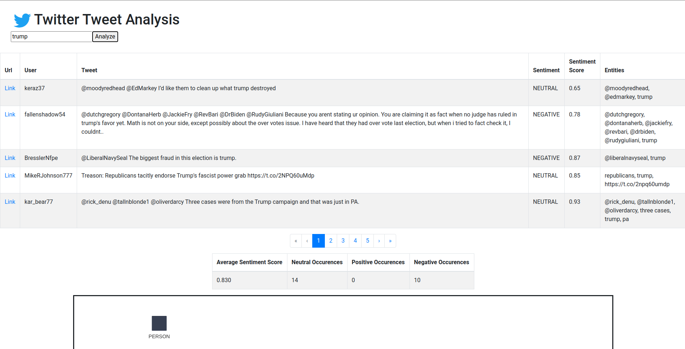
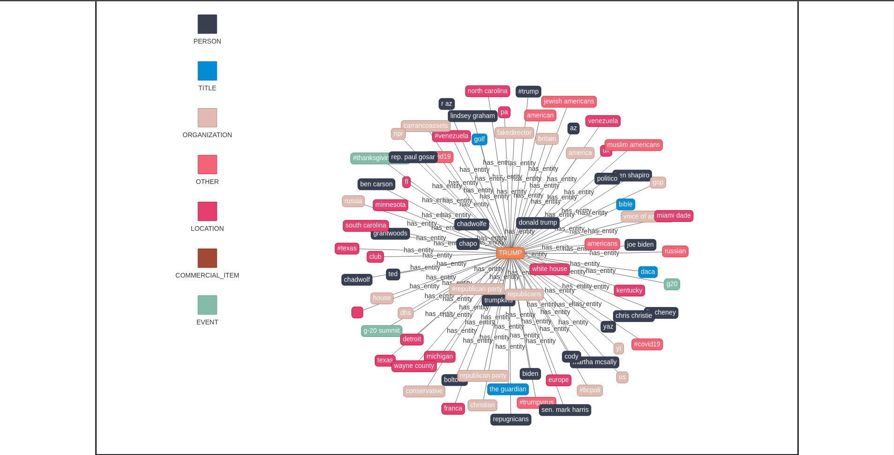
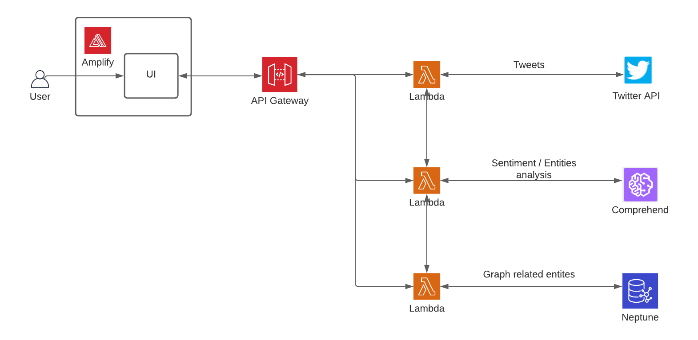

# Twitter Tweets Analysis

An application built using several AWS technologies to provide analysis and insight from tweets. Sentiment and Entities are extracted from tweets using [Comprehend](https://aws.amazon.com/comprehend/) and graphed into [Neptune](https://aws.amazon.com/neptune/) for better visualization and persistence.

## AWS Technologies Used

- Amplify
- API Gateway
- Lambda
- Comprehend
- Neptune
- CloudFormation

## Screenshot

## Sys Diagram

## Docs

- [Boto3](https://boto3.amazonaws.com/v1/documentation/api/latest/index.html) - AWS SDK for Python. Used in this project for `Comprehend` and `Lambda` invocations
- [Gremlin](https://tinkerpop.apache.org/docs/current/) - Querying language for Neptune
- [Tweepy](https://www.tweepy.org/) - Twitter client for Python
- [vis.js](https://visjs.org/) - Visualizing graph data from Neptune
- [AWS Serverless Application Model (SAM)](https://aws.amazon.com/serverless/sam/) - Optional, but recommended. Basically a CLI for Cloudformation setup. Quickly redeploy and push changes from local to AWS

# Deploy

## CloudFormation Setup

1. Go to **CloudFormation**, select _Create Stack_ > _With new resources (standard)_
2. Under _Specify template_, select _Upload a template file_ and upload `cf-template.yaml`, select _Next_
3. Give this stack a name, under _Parameters_, follow the instructions for `SecurityGroupIds` and `SubnetIds`, select _Next_
4. Select _Next_
5. Under _Capabilities and transform_, check ALL boxes, select _Create Stack_
6. The stack will start building all resources (Lambdas, API Gateways, Amplify set up, Neptune cluster) and will take a while
7. Once it has finished (look for _CREATE_COMPLETE_), select the stack and select _Outputs_ (Look for the value for `AnalyzeTweetsEndpoint` and `GetGraphFromNeptuneEndpoint`)

## Amplify Setup

8. Go to **Amplify**, find _All apps_ and select `TwitterTweetsAnalysis`
9. On the side bar, click on `Environment Variables` and create two variables: `VUE_APP_ANALYZE_URL` and `VUE_APP_GET_GRAPH_URL`
10. Set the value for `AnalyzeTweetsEndpoint` as `VUE_APP_ANALYZE_URL` and `GetGraphFromNeptuneEndpoint` for `VUE_APP_GET_GRAPH_URL`
11. Go back to `TwitterTweetsAnalysis` and click _Run Build_, once built and deployed, the application will be marked as deployed and a live url will be generated!
